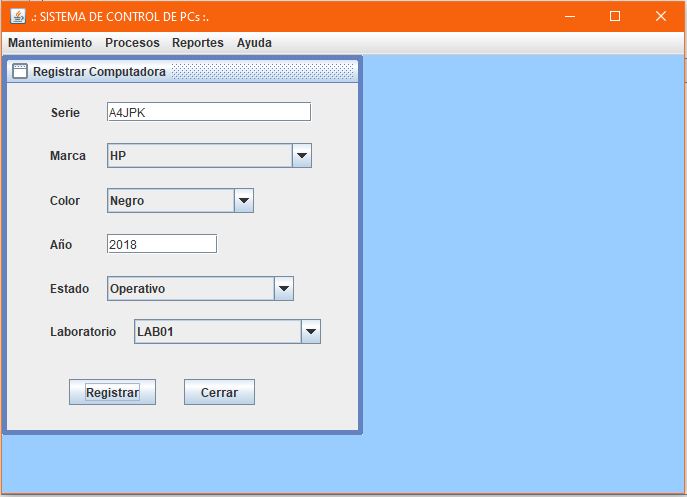
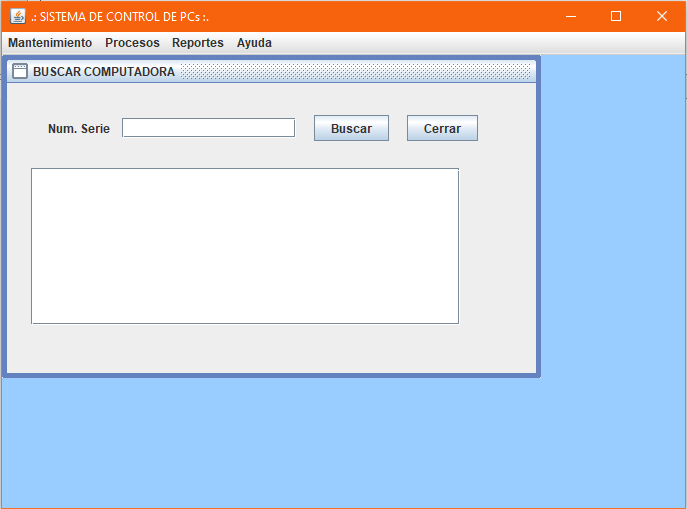
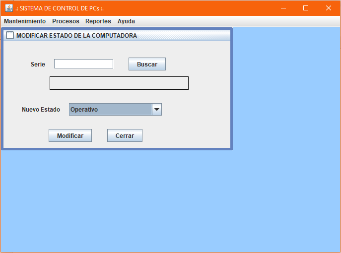
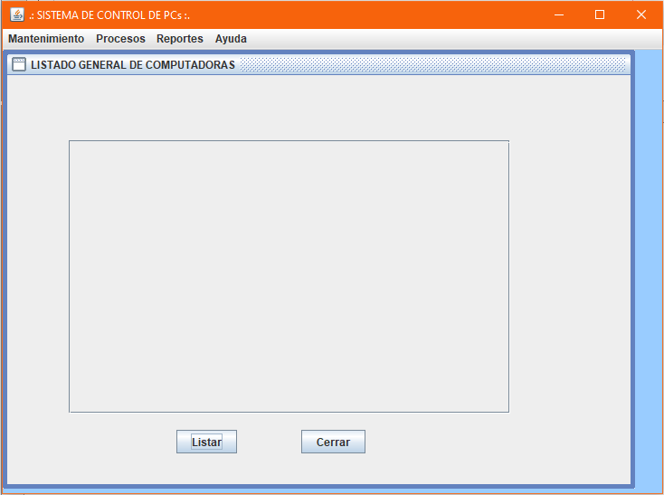
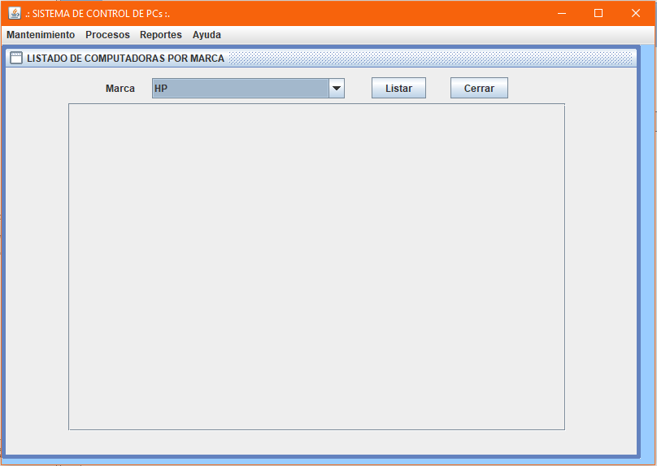
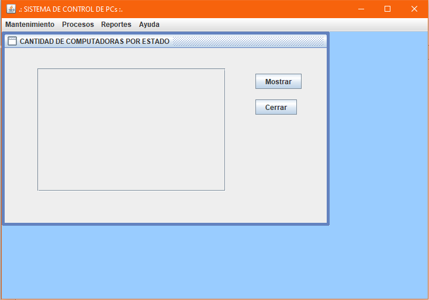

# Sistema de control de computadoras con base de datos
Sistema sobre control de computadoras con base de datos en **PostgreSQL** donde se puede registrar una computadora, en procesos podemos buscar una computadora según su número de serie y registrar el estado actual de una computadora, en los reportes tenemos el listado de todas las computadoras registradas, listado de las computadoras según la marca y mostrar la cantidad de computadoras por su estado, **10/01/20**.

<strong>Imagen:</strong> Mantenimiento - Registrar computadora.

<strong>Imagen:</strong> Procesos - Buscar Computadora por serie.

<strong>Imagen:</strong> Procesos - Registrar el estado actual de una computadora.

<strong>Imagen:</strong> Reportes - Listado de todas las computadoras registradas.

<strong>Imagen:</strong> Reportes - Listado de las computadoras según la marca.

<strong>Imagen:</strong> Reportes - Mostrar la cantidad de computadoras por su estado.

